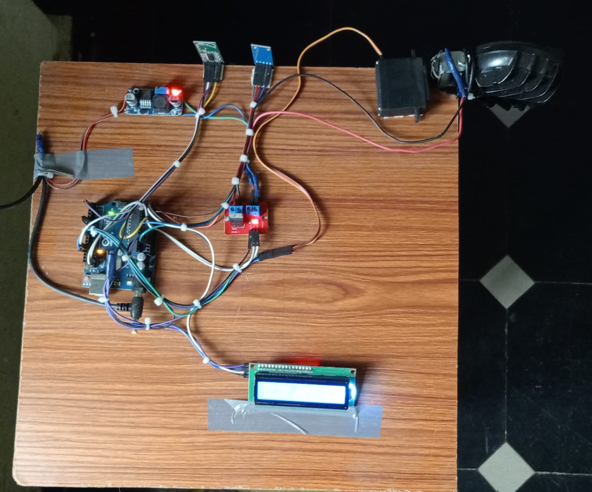
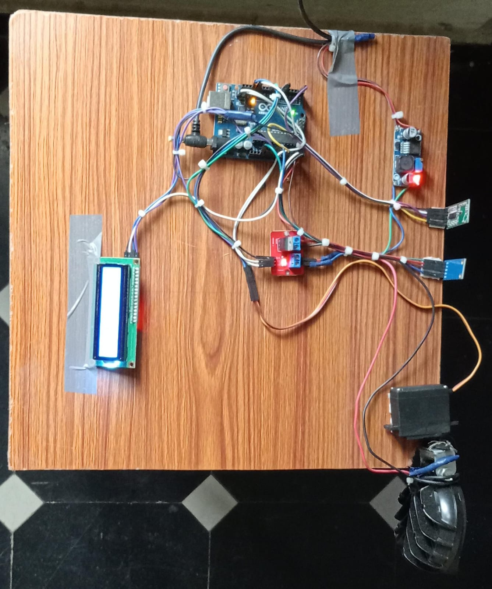

# Automatic Headlight Control System 🚗💡

## 📌 Overview
This project is designed to automatically control vehicle headlights based on ambient light conditions to improve night-time driving safety.

## ⚙️ Components Used
- Arduino Uno
- LDR (Light Dependent Resistor)
- Resistors
- Relay Module / LED
- Power Supply

## 🚀 Features
- Automatically turns headlights ON/OFF
- Detects light intensity using LDR sensor
- Reduces energy consumption
- Improves driver safety

## 🔧 Working Principle
The LDR senses surrounding light intensity. When it gets dark, the system automatically turns ON the headlights. During daylight, it turns them OFF.

## 📸 Project Images

  ### Hardware Setup

### Circuit Diagram

## 📂 Files Included
- Project Report (PDF)
- Arduino Code
- Circuit Diagram

## 🎯 Applications
- Smart vehicles
- Accident prevention systems
- Automated lighting

## 👨‍💻 Author
Ch Gnan Pavan
